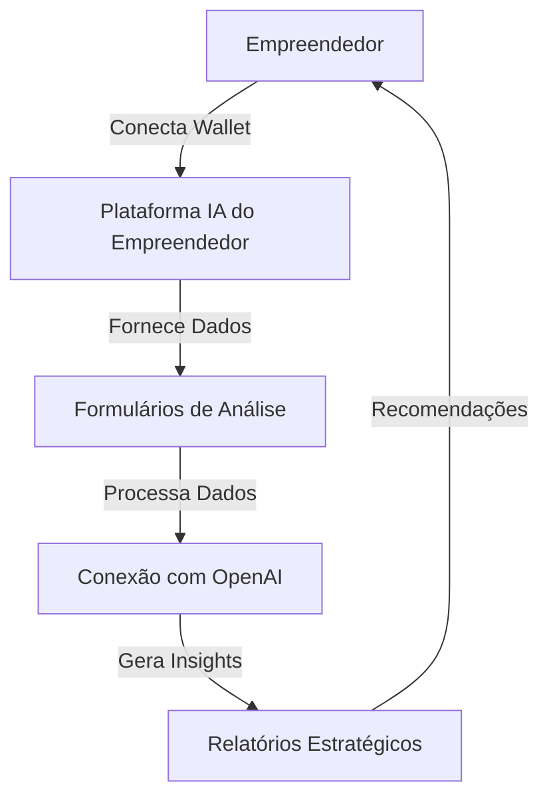
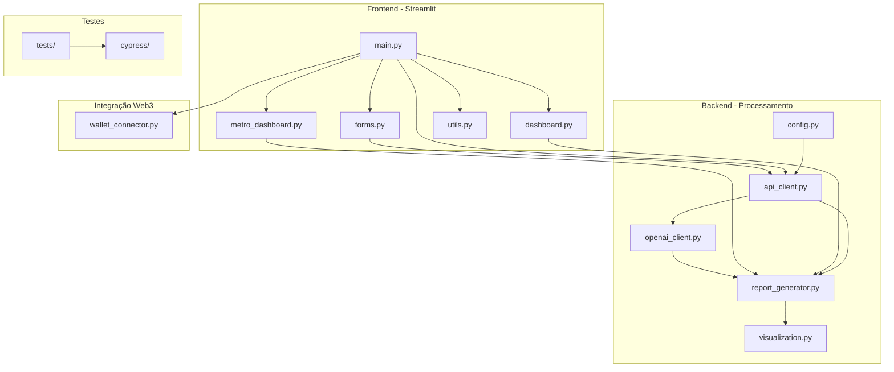
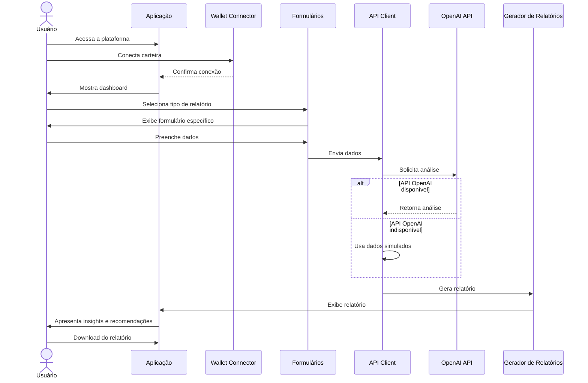
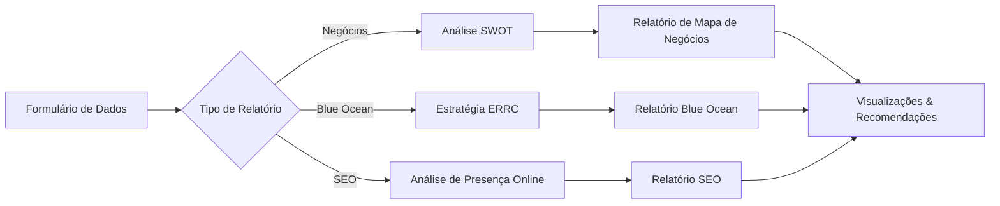

# IA do Empreendedor (AiForEntrepreneursConnect)


Plataforma de análise empresarial impulsionada por IA para empreendedores, que gera insights estratégicos e relatórios personalizados usando tecnologia OpenAI.

## 📋 Índice

- [Visão Geral](#visão-geral)
- [Arquitetura](#arquitetura)
- [Funcionalidades](#funcionalidades)
- [Fluxo do Usuário](#fluxo-do-usuário)
- [Relatórios Disponíveis](#relatórios-disponíveis)
- [Requisitos Técnicos](#requisitos-técnicos)
- [Instalação](#instalação)
- [Configuração](#configuração)
- [Uso](#uso)
- [API OpenAI](#api-openai)
- [Testes](#testes)
- [Contribuição](#contribuição)

## 🔍 Visão Geral

IA do Empreendedor é uma plataforma que utiliza inteligência artificial para analisar dados de negócios e gerar insights estratégicos valiosos. O sistema permite que empreendedores obtenham recomendações personalizadas e relatórios detalhados com base em dados reais de suas empresas.



## 🏗️ Arquitetura

A plataforma segue uma arquitetura modular com separação clara de responsabilidades:



### Componentes Principais

- **main.py**: Ponto de entrada da aplicação e gerenciamento de páginas
- **forms.py**: Formulários de coleta de dados para os diferentes tipos de relatórios
- **openai_client.py**: Cliente para comunicação com a API OpenAI
- **api_client.py**: Camada de abstração para APIs de serviços
- **report_generator.py**: Geração e formatação de relatórios
- **dashboard.py**: Interface de visualização de dados e relatórios
- **metro_dashboard.py**: Dashboard específico para métricas de negócio
- **visualization.py**: Geração de gráficos e visualizações de dados
- **wallet_connector.py**: Integração com carteiras Web3
- **utils.py**: Funções utilitárias e templates para os relatórios
- **config.py**: Configurações do sistema e variáveis de ambiente

## ✨ Funcionalidades

- **Autenticação via Web3**: Conexão segura com carteiras Web3
- **Análise de Negócios**: Mapeamento de negócios e análise SWOT
- **Estratégia Blue Ocean**: Geração de estratégias de mercado inovadoras
- **Análise SEO**: Avaliação de presença digital e recomendações
- **Visualização de Dados**: Gráficos interativos para análise de dados
- **Relatórios Exportáveis**: Download de relatórios em diversos formatos
- **Templates de Relatórios**: Estruturas padronizadas para diferentes tipos de análises
- **Mecanismo de Fallback**: Funcionamento mesmo sem acesso à API OpenAI

## 🔄 Fluxo do Usuário



## 📊 Relatórios Disponíveis

### 1. Mapa de Negócios
Análise completa do modelo de negócio com identificação de forças, fraquezas, oportunidades e ameaças.

### 2. Estratégia Blue Ocean
Análise estratégica para criar novos espaços de mercado usando o framework Eliminar-Reduzir-Aumentar-Criar (ERRC).

### 3. Análise SEO
Avaliação da presença online com recomendações para melhorar a visibilidade e desempenho em motores de busca.



## 🔧 Requisitos Técnicos

- Python 3.11+
- Streamlit
- Plotly para visualizações
- OpenAI API (opcional, sistema funciona com fallback)
- Pacotes auxiliares: Pandas, Base64, etc.
- Node.js (para testes com Cypress)

## 🚀 Instalação

Clone o repositório e instale as dependências:

```bash
git clone https://github.com/seu-usuario/aiforentrepreneursconnect.git
cd aiforentrepreneursconnect
pip install -r requirements.txt --index-url https://pypi.org/
```

## ⚙️ Configuração

1. Copie o arquivo de exemplo de ambiente:
   ```bash
   cp env.example .env
   ```

2. Configure as variáveis de ambiente no arquivo `.env`:
   - `OPENAI_API_KEY`: Sua chave API do OpenAI (opcional)
   - Outras configurações específicas do ambiente

3. Execute a aplicação:
   ```bash
   streamlit run main.py --server.port 5001
   ```

## 🖥️ Uso

1. Acesse a aplicação no navegador (por padrão: http://localhost:5001)
2. Conecte-se usando sua carteira Web3
3. Selecione o tipo de relatório desejado
4. Preencha o formulário com dados do seu negócio
5. Aguarde a geração do relatório com insights personalizados
6. Explore as visualizações e recomendações
7. Faça o download dos relatórios conforme necessário

## 🤖 API OpenAI

A plataforma utiliza a API OpenAI para análise avançada de dados e geração de insights. Embora uma chave API seja recomendada para obter os melhores resultados, o sistema implementa um mecanismo de fallback que permite o funcionamento mesmo sem acesso à API.

### Templates para OpenAI

Os prompts enviados para a API seguem templates estruturados que garantem consistência nos resultados. Os templates estão definidos em `utils.py` e são integrados nos prompts enviados para a API.

## 🧪 Testes

O projeto inclui testes automatizados em dois níveis:

### Testes Python
Execute os testes unitários com pytest:
```bash
pytest

pytest tests/e2e/test_basic_functionality.py::test_landing_page -v
```


## 🤝 Contribuição

Contribuições são bem-vindas! Sinta-se à vontade para abrir um issue ou enviar um pull request.

1. Faça um fork do projeto
2. Crie sua branch de feature (`git checkout -b feature/amazing-feature`)
3. Commit suas mudanças (`git commit -m 'Add some amazing feature'`)
4. Push para a branch (`git push origin feature/amazing-feature`)
5. Abra um Pull Request