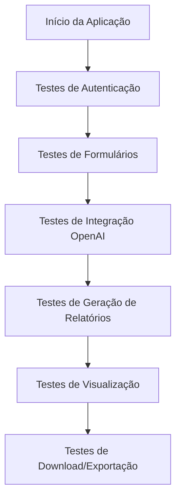
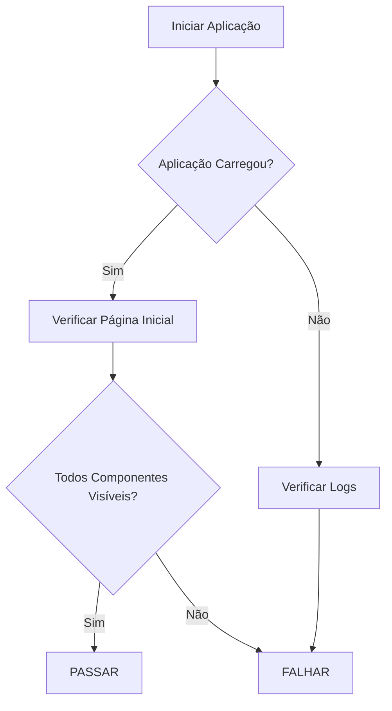
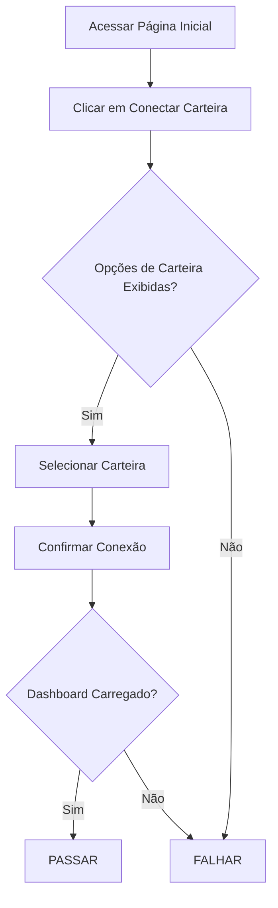
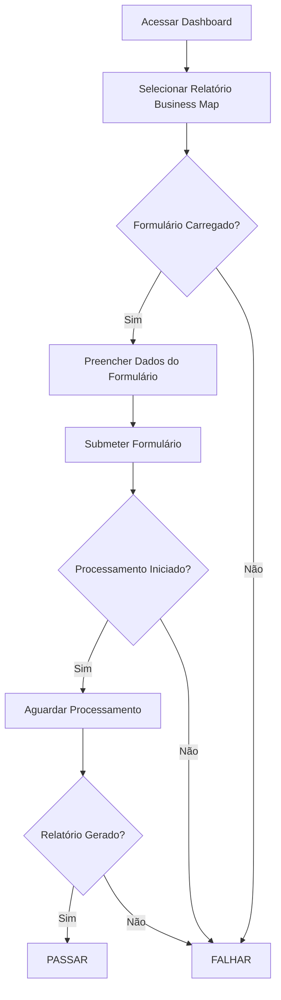
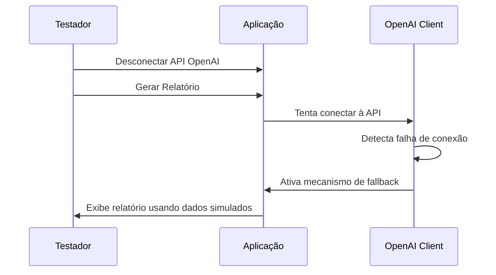
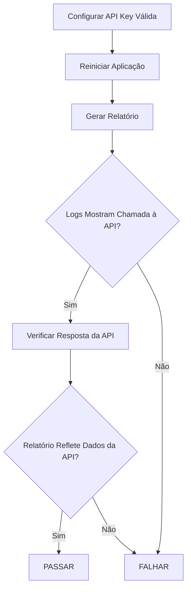
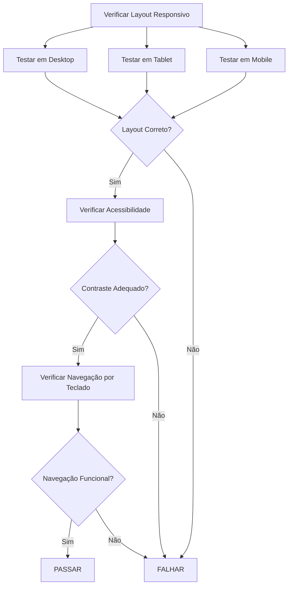
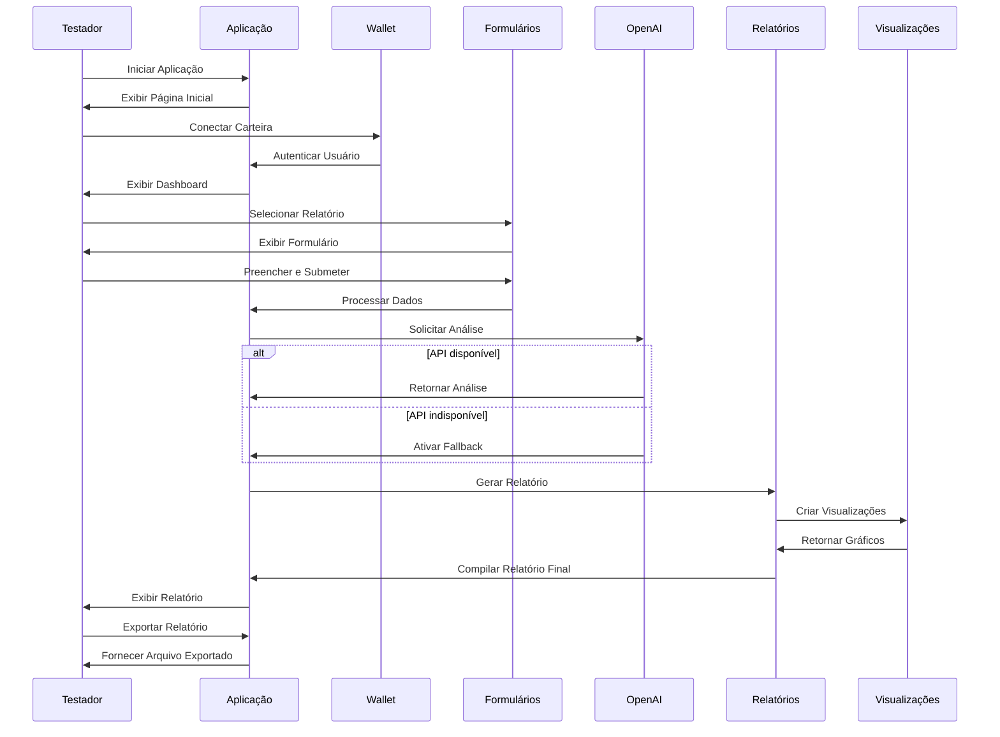

# Plano de Testes End-to-End (E2E)

## Visão Geral

Este documento descreve o plano de testes end-to-end para a plataforma IA do Empreendedor, garantindo que todos os componentes do sistema estejam funcionando corretamente em conjunto.

## 📋 Índice

- [Fluxos de Teste Principais](#fluxos-de-teste-principais)
- [Ambiente de Teste](#ambiente-de-teste)
- [Casos de Teste](#casos-de-teste)
- [Teste de Mecanismo de Fallback](#teste-de-mecanismo-de-fallback)
- [Teste de Integração OpenAI](#teste-de-integração-openai)
- [Teste de Visualização de Dados](#teste-de-visualização-de-dados)
- [Teste de Interface de Usuário](#teste-de-interface-de-usuário)
- [Diagramas de Fluxo de Teste](#diagramas-de-fluxo-de-teste)

## 🔄 Fluxos de Teste Principais

Os testes cobrem os seguintes fluxos principais da aplicação:

## 🛠️ Ambiente de Teste

Os testes devem ser executados em:

1. **Ambiente Local de Desenvolvimento**
   - Python 3.11+
   - Streamlit rodando na porta 5000
   - Variáveis de ambiente configuradas

2. **Ambiente de Staging**
   - Idêntico ao ambiente de produção
   - Chaves de API de teste específicas

## 📝 Casos de Teste

### 1. Teste de Inicialização da Aplicação

**Passos:**
1. Executar `streamlit run main.py`
2. Verificar se a aplicação inicia corretamente
3. Verificar se a página inicial é exibida
4. Verificar se todos os componentes esperados estão visíveis

**Resultado Esperado:**
- Aplicação inicia sem erros
- Página inicial carrega completamente
- Botão de conexão de carteira está visível

### 2. Teste de Autenticação

**Passos:**
1. Clicar no botão "Conectar Carteira"
2. Selecionar opção de carteira
3. Confirmar conexão
4. Verificar redirecionamento para o dashboard

**Resultado Esperado:**
- Opções de carteira são exibidas
- Processo de conexão é iniciado
- Após conexão, usuário é redirecionado para o dashboard
- Endereço da carteira é exibido no dashboard

### 3. Teste do Formulário de Business Map

**Passos:**
1. No dashboard, selecionar "Mapa de Negócios"
2. Preencher todos os campos do formulário
3. Clicar em "Gerar Relatório"
4. Aguardar processamento
5. Verificar geração do relatório

**Resultado Esperado:**
- Formulário é exibido corretamente
- Validação de campos funciona
- Após submissão, indicador de progresso é exibido
- Relatório é gerado e exibido

### 4. Teste do Formulário de Blue Ocean

**Passos:**
1. No dashboard, selecionar "Estratégia Blue Ocean"
2. Preencher todos os campos do formulário
3. Clicar em "Gerar Relatório"
4. Aguardar processamento
5. Verificar geração do relatório

**Resultado Esperado:**
- Formulário Blue Ocean é exibido corretamente
- Validação de campos funciona
- Relatório Blue Ocean é gerado com visualizações específicas
- ERRC framework é corretamente exibido

### 5. Teste do Formulário de SEO

**Passos:**
1. No dashboard, selecionar "Análise SEO"
2. Preencher todos os campos do formulário
3. Clicar em "Gerar Relatório"
4. Aguardar processamento
5. Verificar geração do relatório

**Resultado Esperado:**
- Formulário SEO é exibido corretamente
- Validação de URL funciona
- Relatório SEO é gerado com visualizações específicas
- Recomendações de SEO são exibidas

## 🔄 Teste de Mecanismo de Fallback

**Passos:**
1. Remover/invalidar variável de ambiente `OPENAI_API_KEY`
2. Reiniciar a aplicação
3. Tentar gerar um relatório
4. Observar comportamento

**Resultado Esperado:**
- Aplicação detecta falha na API
- Mecanismo de fallback é ativado automaticamente
- Relatório é gerado usando dados simulados
- Usuário é notificado que dados simulados estão sendo usados

## 🤖 Teste de Integração OpenAI

**Passos:**
1. Configurar variável de ambiente `OPENAI_API_KEY` com chave válida
2. Reiniciar a aplicação
3. Gerar um relatório
4. Verificar logs para confirmar chamada à API
5. Verificar se o relatório reflete dados da API

**Resultado Esperado:**
- Chamada à API OpenAI é registrada nos logs
- Resposta da API é processada corretamente
- Relatório exibe dados e insights da API
- Não há erros de processamento de resposta

## 📊 Teste de Visualização de Dados

**Passos:**
1. Gerar um relatório (qualquer tipo)
2. Verificar se as visualizações são renderizadas
3. Interagir com visualizações (hover, zoom, etc.)
4. Verificar responsividade em diferentes tamanhos de tela

**Resultado Esperado:**
- Visualizações são renderizadas corretamente
- Interatividade das visualizações funciona
- Visualizações são responsivas
- Dados nas visualizações correspondem ao relatório

## 🖥️ Teste de Interface de Usuário

**Passos:**
1. Testar interface em diferentes tamanhos de tela
2. Verificar consistência visual
3. Verificar acessibilidade (contraste, navegação por teclado)
4. Testar carregamento e transições

**Resultado Esperado:**
- Layout se adapta corretamente a diferentes tamanhos de tela
- Elementos visuais são consistentes
- Requisitos de acessibilidade são atendidos
- Carregamento e transições são suaves

## 📊 Diagramas de Fluxo de Teste

### Fluxo Completo de Teste E2E

### Matriz de Testes

O plano completo inclui os seguintes casos de teste:

| ID | Caso de Teste | Prioridade | Dependências |
|----|---------------|------------|--------------|
| T01 | Inicialização da Aplicação | Alta | Nenhuma |
| T02 | Autenticação de Usuário | Alta | T01 |
| T03 | Formulário Business Map | Alta | T02 |
| T04 | Formulário Blue Ocean | Alta | T02 |
| T05 | Formulário SEO | Alta | T02 |
| T06 | Mecanismo de Fallback | Alta | T01 |
| T07 | Integração OpenAI | Alta | T01 |
| T08 | Visualização de Dados | Média | T03, T04, T05 |
| T09 | Responsividade da Interface | Média | T01 |
| T10 | Download de Relatórios | Média | T03, T04, T05 |
| T11 | Desconexão de Carteira | Baixa | T02 |
| T12 | Histórico de Relatórios | Baixa | T03, T04, T05 |