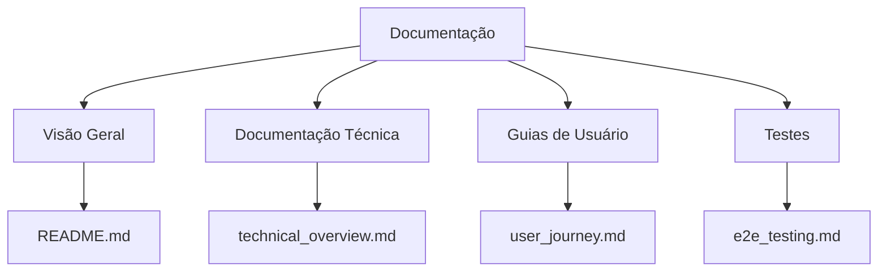
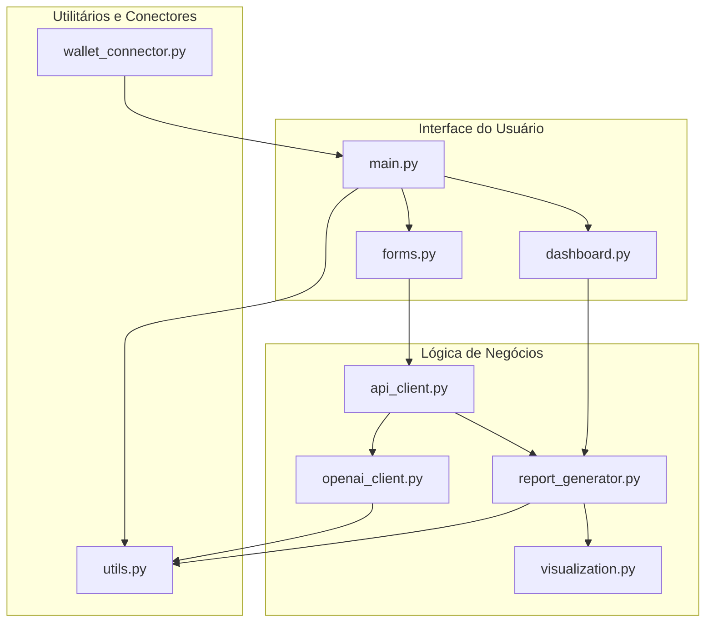
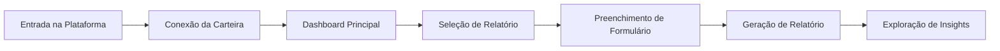
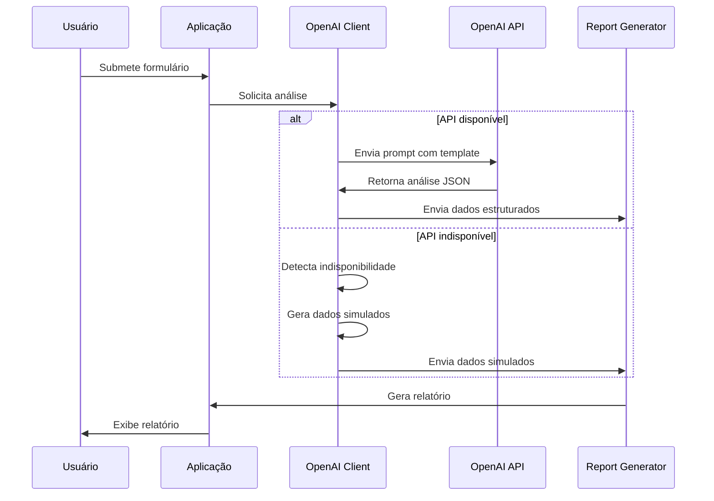

# Documentação: IA do Empreendedor

Bem-vindo à documentação da plataforma IA do Empreendedor. Este conjunto de documentos fornece informações detalhadas sobre a arquitetura, funcionamento e uso do sistema.

## 📋 Índice Geral

### [README Principal](../README.md)
Visão geral do projeto, requisitos e instruções de instalação.

### [Visão Técnica](technical_overview.md)
Detalhamento da arquitetura, fluxo de dados e componentes do sistema.

## 📚 Estrutura da Documentação

### Documentação de Arquitetura
- [Visão Técnica](technical_overview.md): Arquitetura completa do sistema, módulos e integração com OpenAI

### Documentação de Usuário
- [Jornada do Usuário](user_journey.md): Descrição detalhada da experiência do usuário na plataforma

### Testes e Qualidade
- [Plano de Testes E2E](e2e_testing.md): Plano completo de testes end-to-end para a plataforma

## 📊 Diagramas Principais

### Arquitetura do Sistema

### Fluxo de Usuário Simplificado

### Processo de Integração com OpenAI

## 🔄 Atualização da Documentação

Estas documentações devem ser mantidas atualizadas conforme o projeto evolui. Ao fazer mudanças no código:

1. Verifique se a alteração impacta algum diagrama ou descrição
2. Atualize os diagramas Mermaid conforme necessário
3. Revise as descrições de fluxo e comportamento
4. Atualize os casos de teste quando novas funcionalidades forem adicionadas