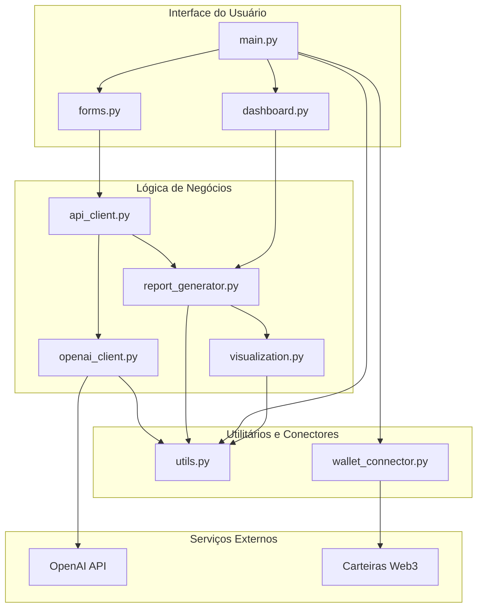
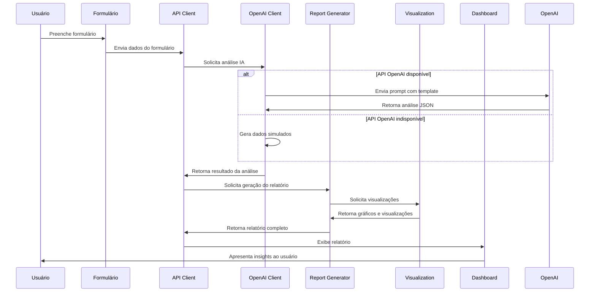
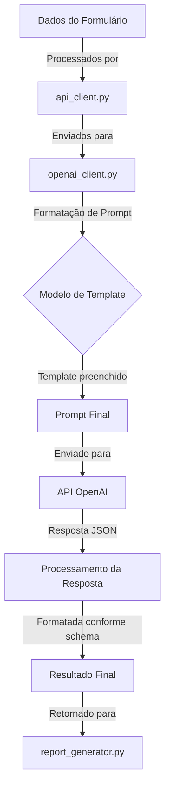
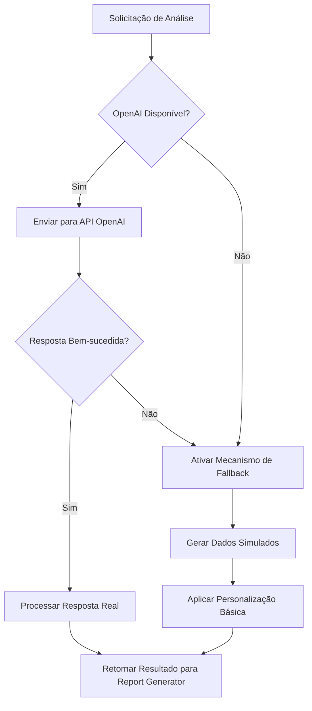
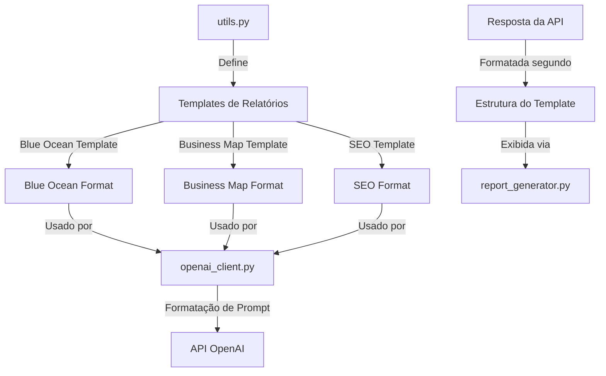
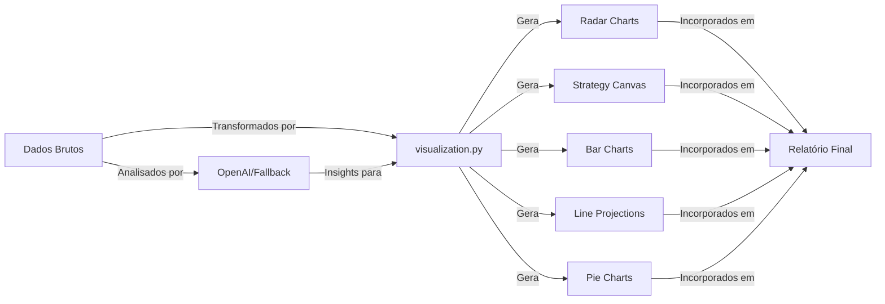
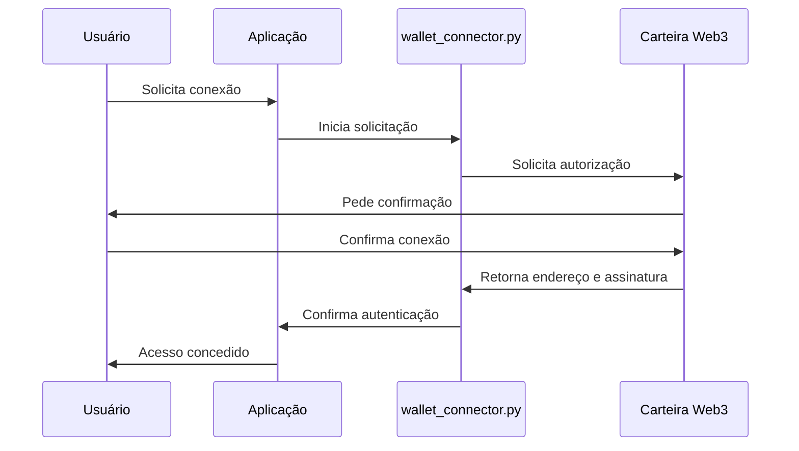

# Documentação Técnica: IA do Empreendedor

Este documento fornece uma visão técnica detalhada da arquitetura, fluxo de dados e componentes do sistema IA do Empreendedor.

## 📋 Índice

- [Visão Geral da Arquitetura](#visão-geral-da-arquitetura)
- [Estrutura de Módulos](#estrutura-de-módulos)
- [Fluxo de Dados](#fluxo-de-dados)
- [Integração com OpenAI](#integração-com-openai)
- [Mecanismo de Fallback](#mecanismo-de-fallback)
- [Sistema de Templates de Relatórios](#sistema-de-templates-de-relatórios)
- [Visualizações de Dados](#visualizações-de-dados)
- [Conexão Web3](#conexão-web3)
- [Pontos de Extensão](#pontos-de-extensão)

## 🏛️ Visão Geral da Arquitetura

O sistema segue uma arquitetura modular com separação clara de responsabilidades, utilizando o padrão MVC (Model-View-Controller) adaptado para o contexto de uma aplicação Streamlit.

## 📦 Estrutura de Módulos

### 1. Interface do Usuário
- **main.py**: Ponto de entrada principal da aplicação, gerencia o roteamento entre as diferentes páginas.
- **dashboard.py**: Responsável por exibir a interface do dashboard principal e relatórios gerados.
- **forms.py**: Contém a lógica e os componentes de UI para os formulários de coleta de dados.

### 2. Lógica de Negócios
- **api_client.py**: Camada de abstração para chamadas de API, gerencia interfaces com serviços.
- **openai_client.py**: Cliente específico para a API da OpenAI, formata prompts e processa respostas.
- **report_generator.py**: Geração e formatação de relatórios com base nos dados e insights da IA.
- **visualization.py**: Criação de visualizações e gráficos interativos.

### 3. Utilitários e Conectores
- **utils.py**: Funções utilitárias, templates para relatórios e helpers compartilhados.
- **wallet_connector.py**: Gerencia a conexão com carteiras Web3 para autenticação.

## 🔁 Fluxo de Dados

O diagrama abaixo mostra o fluxo completo de dados no processo de geração de relatórios:

## 🤖 Integração com OpenAI

### Processo de Solicitação à API

### Estrutura de Chamadas à API OpenAI

A integração com a OpenAI utiliza os seguintes componentes:

1. **Templates de Prompt**: Definidos em `utils.py`, fornecem a estrutura básica para os prompts enviados.
2. **Personalização de Prompts**: Os templates são preenchidos com dados do usuário.
3. **Formatação de Resposta**: As solicitações são configuradas para retornar respostas em formato JSON.
4. **Processamento de Erros**: Captação e tratamento de erros de API.

## 🔄 Mecanismo de Fallback

Um dos principais diferenciais do sistema é seu robusto mecanismo de fallback, que permite a operação mesmo quando a API OpenAI está indisponível:

### Implementação do Fallback

- Verificação proativa da disponibilidade da API
- Detecção de erros (429, 500, timeout)
- Geração de dados simulados realistas baseados nas entradas do usuário
- Adaptação dos dados simulados ao contexto específico do relatório

## 📝 Sistema de Templates de Relatórios

Os templates de relatórios são fundamentais para garantir consistência na saída:

### Estrutura de Templates

- **Cabeçalhos e Seções**: Formatação consistente para todos os relatórios
- **Placeholders Dinâmicos**: Substituídos por dados específicos do usuário
- **Elementos Visuais**: Definições para a integração de gráficos e visualizações
- **Formatação Markdown**: Uso extensivo de markdown para melhorar a legibilidade

## 📊 Visualizações de Dados

O sistema gera visualizações dinâmicas baseadas nos dados de entrada e nas análises de IA:

### Tipos de Visualizações por Relatório

1. **Mapa de Negócios**
   - Radar Chart de áreas de negócio
   - Comparação com médias do mercado
   - Projeção de crescimento

2. **Blue Ocean**
   - Strategy Canvas (curvas de valor)
   - Framework ERRC
   - Projeção de Performance

3. **SEO**
   - Performance de palavras-chave
   - Distribuição de tráfego
   - Matriz de oportunidades

## 🔗 Conexão Web3

O sistema utiliza conexão com carteiras Web3 para autenticação:

### Funcionalidades Web3

- **Simulação de Conexão**: Sistema funcional mesmo sem blockchain real
- **Verificação de Saldo de Tokens**: Simulação de verificação para acesso a recursos Premium
- **Verificação de Identidade**: Uso do endereço da carteira como identificador único

## 🔌 Pontos de Extensão

O sistema foi projetado para ser facilmente extensível nos seguintes pontos:

1. **Novos Tipos de Relatórios**
   - Adicionar novo template em `utils.py`
   - Criar função de geração em `report_generator.py`
   - Implementar formulário em `forms.py`
   - Adicionar cliente de API correspondente em `openai_client.py`

2. **Novas Visualizações**
   - Adicionar funções de visualização em `visualization.py`
   - Integrar na exibição do relatório

3. **Integrações Adicionais**
   - Adicionar novos clientes de API em `api_client.py`
   - Implementar conectores específicos quando necessário