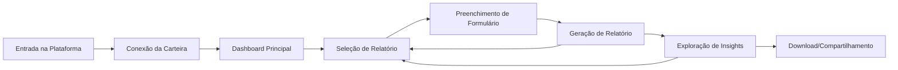
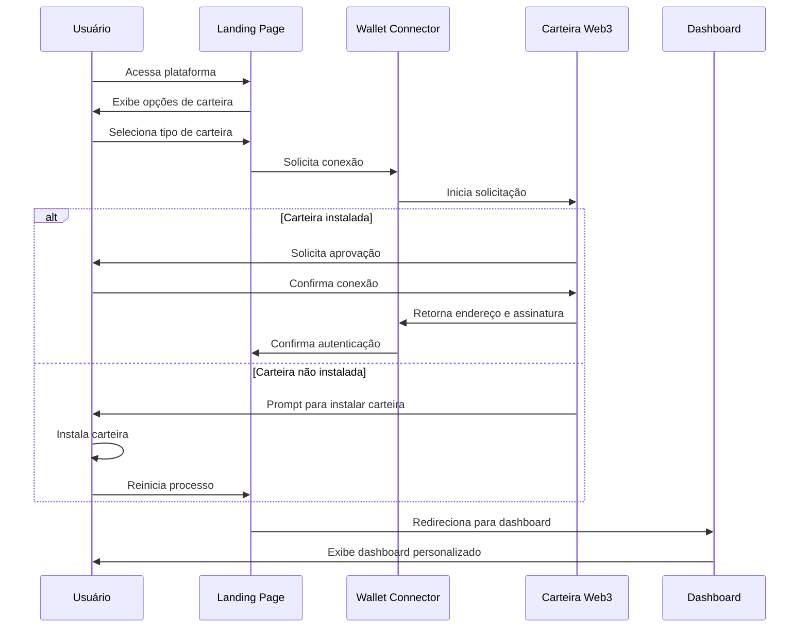
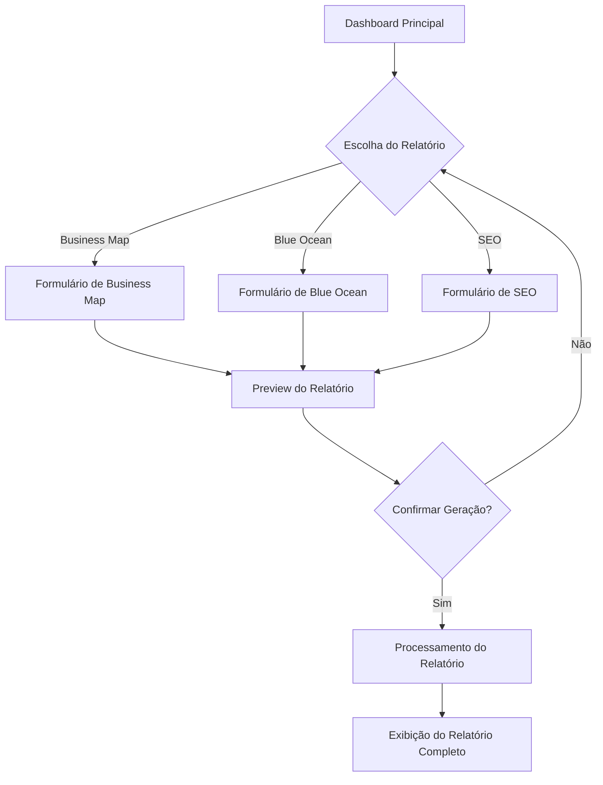
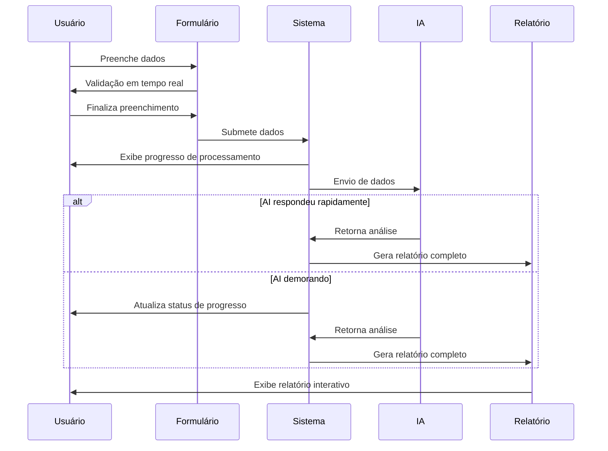
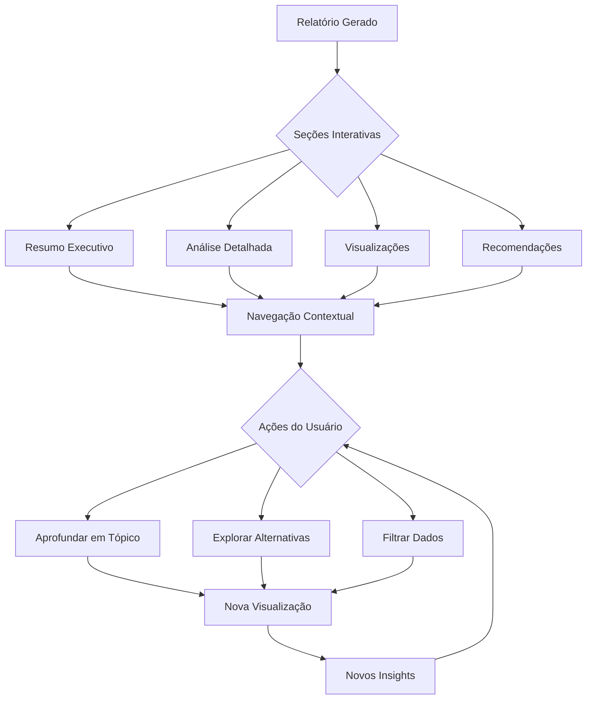
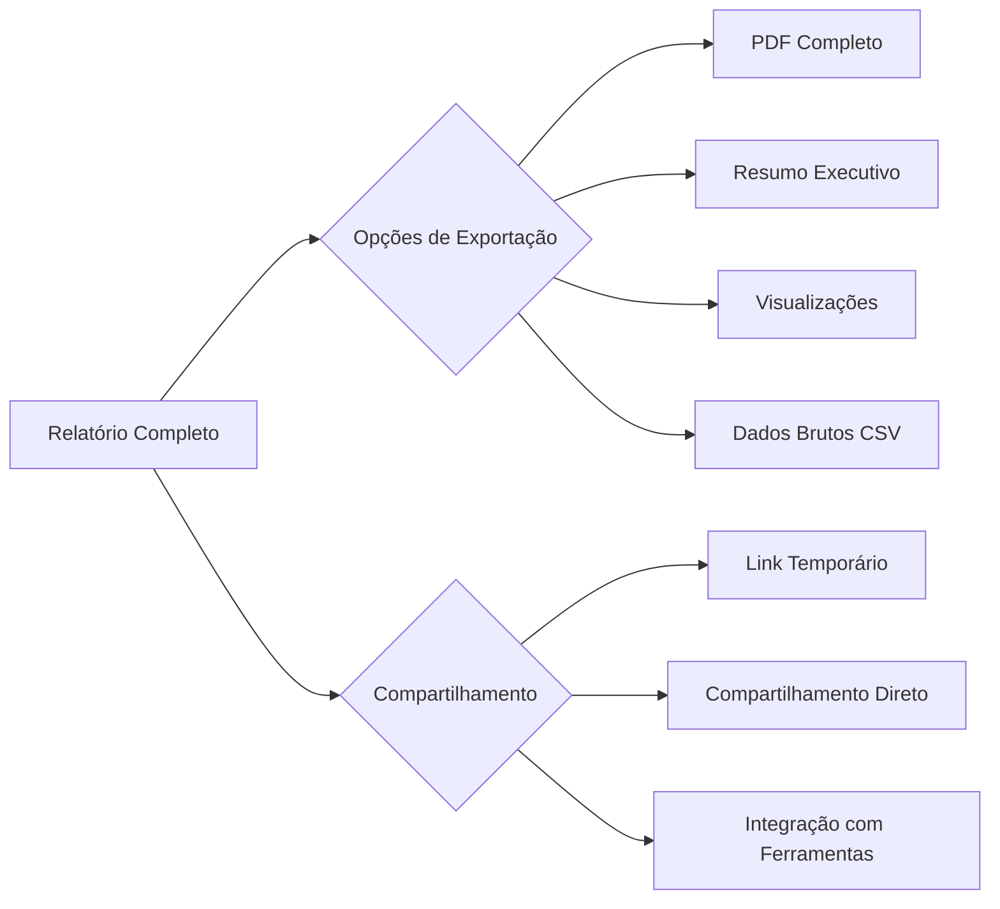
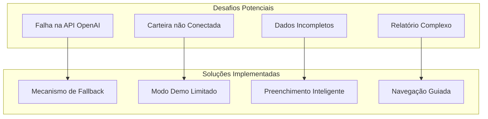

# Jornada do Usuário: IA do Empreendedor

Este documento descreve a jornada completa do usuário na plataforma IA do Empreendedor, detalhando cada etapa da interação do usuário com o sistema.

## 📋 Índice

- [Visão Geral da Jornada](#visão-geral-da-jornada)
- [Fluxo Principal](#fluxo-principal)
- [Conexão de Carteira](#conexão-de-carteira)
- [Seleção de Relatório](#seleção-de-relatório)
- [Jornada de Geração de Relatório](#jornada-de-geração-de-relatório)
- [Exploração de Insights](#exploração-de-insights)
- [Download e Compartilhamento](#download-e-compartilhamento)
- [Pontos de Fricção e Soluções](#pontos-de-fricção-e-soluções)

## 🔍 Visão Geral da Jornada

A jornada do usuário na plataforma IA do Empreendedor é projetada para ser intuitiva, eficiente e valiosa, conduzindo empreendedores desde a autenticação até a obtenção de insights estratégicos personalizados.

## 🚶 Fluxo Principal

### 1. Acesso à Plataforma
O usuário acessa a plataforma IA do Empreendedor através de um navegador web.

### 2. Conexão de Carteira
O sistema solicita a conexão de uma carteira Web3 para autenticação do usuário.

### 3. Dashboard Principal
Após autenticação, o usuário é redirecionado para o dashboard principal.

### 4. Seleção de Relatório
O usuário escolhe o tipo de relatório que deseja gerar.

### 5. Preenchimento de Formulário
O sistema apresenta um formulário específico para o tipo de relatório escolhido.

### 6. Geração de Relatório
Após o preenchimento do formulário, o sistema gera o relatório solicitado.

### 7. Exploração de Insights
O usuário explora os insights, visualizações e recomendações do relatório.

### 8. Download e Compartilhamento
O usuário pode fazer download do relatório ou compartilhá-lo.

## 🔗 Conexão de Carteira

A conexão de carteira é o ponto de entrada principal para a plataforma:

### Experiência do Usuário

- **Primeira Visita**: Para novos usuários, uma breve explicação sobre carteiras Web3 é fornecida.
- **Conexão Rápida**: Para usuários recorrentes, o sistema tenta reconectar automaticamente.
- **Modos de Fallback**: Opção para prosseguir sem conectar carteira em modo demo limitado.

## 📊 Seleção de Relatório

O processo de seleção de relatório é projetado para ser intuitivo:

### Diferenciação de Relatórios

Cada tipo de relatório é apresentado com:
- Descrição clara e objetiva
- Exemplo visual do resultado final
- Indicação do tempo estimado para geração
- Requisitos específicos de dados

## 📝 Jornada de Geração de Relatório

A geração de relatório é dividida em etapas lógicas com feedback constante ao usuário:

### Formulários Inteligentes

Cada formulário inclui:
- Validação em tempo real
- Dicas contextuais
- Auto-preenchimento inteligente
- Salvamento automático de rascunhos

## 🔍 Exploração de Insights

A experiência de exploração do relatório é projetada para maximizar o valor para o usuário:

### Funcionalidades Interativas

- **Gráficos Interativos**: Possibilidade de ajustar parâmetros e ver mudanças em tempo real
- **Drill-Down**: Aprofundamento em tópicos específicos
- **Filtros Dinâmicos**: Personalização da visualização de dados
- **Links Contextuais**: Navegação inteligente entre seções relacionadas

## 📤 Download e Compartilhamento

Múltiplas opções de exportação e compartilhamento:

### Formatos e Opções

- **PDF Personalizado**: Relatório completo com branding
- **Visualizações Individuais**: Exportação de gráficos específicos
- **Dados Estruturados**: Opção de exportar dados brutos para análise posterior
- **Compartilhamento Seguro**: Links temporários com controle de acesso

## 🚧 Pontos de Fricção e Soluções

A plataforma identifica potenciais desafios e implementa soluções proativas:

### Atendimento a Diversos Níveis de Usuários

- **Novos Usuários**: Experiência guiada com explicações contextuais
- **Usuários Intermediários**: Dicas avançadas opcionais
- **Usuários Avançados**: Opções de personalização profunda e exportação de dados